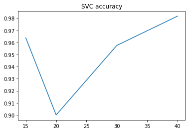

Цель данной работы - написание и сравнение нескольких классификаторов для определения языка текста.

Для начала наберём по 150 текстов английского, немецкого, испанского и итальянского языка для обучающей и тестовой выборок. В процессе сбора текстов они будут обработаны: все символы будут приведены к нижнему регистру, символы, не присутствующие в данном языке (цифры, иноязычные символы, знаки переносов, форматирование и т.п.) будут удалены. После препроцессинга останутся только токены из символов, принадлежащих языку.


```python
#Было убрано предупреждение о замене маркапа в BeautifulSoup
import wikipedia
import re

#de: [a-zäöüß]
#es: [a-zñáéíóú]
#it: [a-zàèéìíòóùú]

texts = []
labels = []

wikipedia.set_lang('en')
en_pages = wikipedia.random(pages=150)

for i in en_pages:
    #этот блок обходит возможную DisambiguationError
    try:
        page = wikipedia.page(i)
        content_raw = page.content.lower()
        content_tokens = re.findall('[a-z]+', content_raw)
        content = ' '.join(content_tokens)
        texts.append(content)
        labels.append('en')
    except:
        pass

wikipedia.set_lang('de')
de_pages = wikipedia.random(pages=150)

for i in de_pages:
    try:
        page = wikipedia.page(i)
        content_raw = page.content.lower()
        content_tokens = re.findall('[a-zäöüß]+', content_raw)
        content = ' '.join(content_tokens)
        texts.append(content)
        labels.append('de')
    except:
        pass
    
wikipedia.set_lang('it')
it_pages = wikipedia.random(pages=150)

for i in it_pages:
    try:
        page = wikipedia.page(i)
        content_raw = page.content.lower()
        content_tokens = re.findall('[a-zàèéìíòóùú]+', content_raw)
        content = ' '.join(content_tokens)
        texts.append(content)
        labels.append('it')
    except:
        pass
    
wikipedia.set_lang('es')
es_pages = wikipedia.random(pages=150)

for i in es_pages:
    try:
        page = wikipedia.page(i)
        content_raw = page.content.lower()
        content_tokens = re.findall('[a-zñáéíóú]+', content_raw)
        content = ' '.join(content_tokens)
        texts.append(content)
        labels.append('es')
    except:
        pass
    
```

Запишем наши тексты и их лейблы в .csv-файл, чтобы не собирать их каждый раз заново.


```python
import csv
with open('en_de_it_es.csv', 'w') as csvfile:
    filewriter = csv.writer(csvfile, delimiter=',', quoting=csv.QUOTE_MINIMAL)
    filewriter.writerow(['label', 'text'])
    for i in texts:
        filewriter.writerow([labels[texts.index(i)],i])
```

Соберём датасет, с которым будем работать далее.


```python
import pandas as pd
dataset = pd.read_csv('en_de_it_es.csv')
```

Сравним три обработанных английских текста с их необработанными версиями:

Chocotto Sister (https://en.wikipedia.org/wiki/Chocotto_Sister)
Приведено в сокращении, т.к. оригинальная статья достаточно длинная.

Chocotto Sister (ちょこッとSister) is a manga series written by Go Zappa and illustrated by Sakura Takeuchi. It is published by Hakusensha in the magazine Young Animal and collected in 8 tankōbon volumes. The series has been adapted as a 24-episode anime by Nomad, airing in 2006 and released on 8 DVDs. It is also known as Chokotto Sister and Chocosis.


== Plot ==
The story centers around a Christmas wish made by a young Haruma Kawagoe, who was eagerly anticipating having a baby sister, after his mother suffered a miscarriage followed by a hysterectomy. Several years later, when Haruma is a college student, a woman on a flying motorbike claiming to be Santa Claus delivers his wish, a younger sister. When he remarks that he made his wish a long time ago, "Santa" replies that making a little sister takes a lot more time than just making an android, takes his signature for delivery, and departs. Haruma now has a little sister, who comes with her own instruction manual — a manual for how to be a little sister, that is. When she asks him to name her, he calls her Choko, which refers to the Japanese word for "manual".

chocotto sister sister is a manga series written by go zappa and illustrated by sakura takeuchi it is published by hakusensha in the magazine young animal and collected in tank bon volumes the series has been adapted as a episode anime by nomad airing in and released on dvds it is also known as chokotto sister and chocosis plot the story centers around a christmas wish made by a young haruma kawagoe who was eagerly anticipating having a baby sister after his mother suffered a miscarriage followed by a hysterectomy several years later when haruma is a college student a woman on a flying motorbike claiming to be santa claus delivers his wish a younger sister when he remarks that he made his wish a long time ago santa replies that making a little sister takes a lot more time than just making an android takes his signature for delivery and departs haruma now has a little sister who comes with her own instruction manual a manual for how to be a little sister that is when she asks him to name her he calls her choko which refers to the japanese word for manual 

Можно видеть, что здесь убраны японские иероглифы, разметка страницы, цифры (например, дата, количество DVD), пунктуационные знаки, а также текст приведён к нижнему регистру.

Hongi Hika (https://en.wikipedia.org/wiki/Hongi_Hika)
Приведено в сокращении.

hongi hika c march was a new zealand m ori rangatira chief and war leader of the ng puhi iwi tribe hongi hika used european weapons to overrun much of northern new zealand in the first of the musket wars he also encouraged p keh european settlement patronised new zealand s first missionaries introduced m ori to western agriculture and helped put the m ori language into writing he travelled to england and met king george iv hongi hika s military campaigns and the other musket wars were one of the most important stimuli for the british annexation of new zealand and subsequent treaty of waitangi with ng puhi and many other iwi he was a pivotal figure in the period when m ori history emerged from myth and oral tradition and p keh began to settle rather than just visit 

Hongi Hika (c. 1772 – 6 March 1828) was a New Zealand Māori rangatira (chief) and war leader of the Ngāpuhi iwi (tribe).

Hongi Hika used European weapons to overrun much of northern New Zealand in the first of the Musket Wars. He also encouraged Pākehā (European) settlement, patronised New Zealand's first missionaries, introduced Māori to Western agriculture and helped put the Māori language into writing. He travelled to England and met King George IV. Hongi Hika's military campaigns, and the other Musket Wars were one of the most important stimuli for the British annexation of New Zealand and subsequent Treaty of Waitangi with Ngāpuhi and many other iwi. He was a pivotal figure in the period when Māori history emerged from myth and oral tradition and Pākehā began to settle rather than just visit.

В данном тексте убраны буквы, не встречающиеся в английском языке (например, ā в Māori), а также, как и везде, убрана разметка, пунктуация и цифры, нормализован регистр. Не обработанными остались римские цифры (King George IV), а также не были заменены незнакомые буквы, что привело к разрывам слов (m ori).

Ogino_Station_(Toyama) (https://en.wikipedia.org/wiki/Ogino_Station_(Toyama))
Здесь приведена полная статья, т.к. она достаточно короткая.

Ogino Station (荻布駅, Ogino Eki) is a city tram station on the Takaoka Kidō Line located in Takaoka, Toyama Prefecture, Japan.

ogino station ogino eki is a city tram station on the takaoka kid line located in takaoka toyama prefecture japan

Здесь убраны иероглифы и нестардартные буквы (Kidō), также текст нормализован, убрана пунктуация. Можно также заметить, что page.content не загружает таблицу, присутствующую в оригинале, соответсвенно, она остаётся необработанной.

Теперь посмотрим на немецкие тексты.

Homestuck (https://de.wikipedia.org/wiki/Homestuck)

Homestuck ist ein Webcomic, das von dem Amerikaner Andrew Hussie seit 2009 geschaffen wird. Es ist eines von vier unabhängigen Hauptwerken, die er auf seiner Webcomicseite MS Paint Adventures (MSPA) veröffentlicht. Das beständig weitergeführte Werk umfasste bis 2015 mehr als 7.500 Seiten mit Einzelbildern und 768.000 Wörtern und ist damit eines der umfangreichsten weltweit veröffentlichten Werke des Genres. 
In Amerika verfügt das Werk über eine große Fangemeinde, die z. B. ein Wiki über das Projekt geschaffen hat, in dem man etwa den Überblick über die inzwischen 128 Charaktere behalten kann. Einige deutsche Fans bieten eine Teilübersetzung und weitere Informationen an. Weiterhin existiert eine von Fans gepflegte französische Übersetzung.Die Bilder des Comics sind sehr einfach gehalten, im Stil einer einfachen MS-Paint-Zeichnung, worauf auch der Titel der Homepage anspielt. Die Bilder enthalten oft Gameelemente von Adventure Games, wie eine Inventarfunktion oder kleine Flashanimationen.


== Geschichte ==
Hauptakteure sind der zu Beginn der Geschichte 13-jährige John Egbert und seine Freunde Rose Lalonde, Dave Strider and Jade Harley. John Egbert erhält das Computerspiel Sburb, das es ermöglicht in die Wirklichkeit einzugreifen, und beginnt es mit seinen Freunden zu spielen. Dieses Spiel ist Teil des Fortpflanzungszyklus des Universums, die Spieler und ihre gesamte Wirklichkeit werden dafür also in das Spiel gezogen.


== Weblinks ==

 Heimatseite des Comic und seiner Ableger wie Paradox Space, sowie weiterer Webcomics von Hussie
 MSPA Wiki Homestuck


== Quelle ==
 Veronika Kracher: "Du kannst kein Wort dieses Idioten verstehen" Technisch innovative Webcomics wie "Homestuck" sprengen die Grenzen traditioneller Epen und Romane. in konkret 8/2015, S. 62/63


== Einzelnachweise ==

homestuck ist ein webcomic das von dem amerikaner andrew hussie seit geschaffen wird es ist eines von vier unabhängigen hauptwerken die er auf seiner webcomicseite ms paint adventures mspa veröffentlicht das beständig weitergeführte werk umfasste bis mehr als seiten mit einzelbildern und wörtern und ist damit eines der umfangreichsten weltweit veröffentlichten werke des genres in amerika verfügt das werk über eine große fangemeinde die z b ein wiki über das projekt geschaffen hat in dem man etwa den überblick über die inzwischen charaktere behalten kann einige deutsche fans bieten eine teilübersetzung und weitere informationen an weiterhin existiert eine von fans gepflegte französische übersetzung die bilder des comics sind sehr einfach gehalten im stil einer einfachen ms paint zeichnung worauf auch der titel der homepage anspielt die bilder enthalten oft gameelemente von adventure games wie eine inventarfunktion oder kleine flashanimationen geschichte hauptakteure sind der zu beginn der geschichte jährige john egbert und seine freunde rose lalonde dave strider and jade harley john egbert erhält das computerspiel sburb das es ermöglicht in die wirklichkeit einzugreifen und beginnt es mit seinen freunden zu spielen dieses spiel ist teil des fortpflanzungszyklus des universums die spieler und ihre gesamte wirklichkeit werden dafür also in das spiel gezogen weblinks heimatseite des comic und seiner ableger wie paradox space sowie weiterer webcomics von hussie mspa wiki homestuck quelle veronika kracher du kannst kein wort dieses idioten verstehen technisch innovative webcomics wie homestuck sprengen die grenzen traditioneller epen und romane in konkret s einzelnachweise

Здесь можно заметить, что ссылки изначально не входят в page.content, хотя присутствует соответствующая им часть (== Einzelnachweise ==). Таким образом, ссылки не обрабатываются. В остальном осуществляется обычная предобработка с сохранением специфичных для немецкого языка символов.

Mustafa Aykaç (https://de.wikipedia.org/wiki/Mustafa_Ayka%C3%A7)

Mustafa Aykaç  (* 1958 in Karabük) ist ein türkischer Ökonom und Rektor der Kırklareli Üniversitesi.


== Leben und Wirken ==
Nach dem Besuch der Schule in Karabük und des Gymnasiums in Istanbul studierte er Ökonomie in der Handelshochschule in Bursa (1976–1980). Danach trat er als wissenschaftlicher Mitarbeiter in die Fakultät für Wirtschafts- und Sozialwissenschaften der Universität Bursa (Uludağ Üniversitesi) ein und wurde 1987 zum Doktor der Ökonomie promoviert. 
Im Jahr 1987 wechselte Aykaç zur Marmara Üniversitesi, wurde 1989 Assistenzprofessor und 1993 Professor. Er wurde Institutsdirektor, Dekan und Vizepräsident der Universität. Auslandseinsätze von jeweils einem Jahr führten ihn 1997 an die Manchester University nach England und 2003 an die Vista University in Südafrika. 
Er hat zahlreiche Veröffentlichungen in nationalen und internationalen Zeitungen vorzuweisen. Er wurde im Jahr 2008 zum Rektor der Kirklareli-Universität berufen. 
Mustafa Aykaç ist verheiratet und hat drei Kinder.   


== Weblinks ==
 Rektor Mustafa Aykaç auf der Webpage der Universität
 Webpage Kirklareli Universität
 Webpage Namik Kemal Universität


== Literatur ==
 Enver Duran: Challenges of Higher Education Institutions in the Balkans, III Balkan Universities Network Meeting, Trakya Universität Edirne Mai 2010, ISBN 978-975-374-134-7 
 Manfred G. Raupp: Lörrach Symposium - Lörrach Sempozyumu, Trakya Universität Edirne Mai 2011, ISBN 978-3-942298-02-5

mustafa ayka in karabük ist ein türkischer ökonom und rektor der k rklareli üniversitesi leben und wirken nach dem besuch der schule in karabük und des gymnasiums in istanbul studierte er ökonomie in der handelshochschule in bursa danach trat er als wissenschaftlicher mitarbeiter in die fakultät für wirtschafts und sozialwissenschaften der universität bursa uluda üniversitesi ein und wurde zum doktor der ökonomie promoviert im jahr wechselte ayka zur marmara üniversitesi wurde assistenzprofessor und professor er wurde institutsdirektor dekan und vizepräsident der universität auslandseinsätze von jeweils einem jahr führten ihn an die manchester university nach england und an die vista university in südafrika er hat zahlreiche veröffentlichungen in nationalen und internationalen zeitungen vorzuweisen er wurde im jahr zum rektor der kirklareli universität berufen mustafa ayka ist verheiratet und hat drei kinder weblinks rektor mustafa ayka auf der webpage der universität webpage kirklareli universität webpage namik kemal universität literatur enver duran challenges of higher education institutions in the balkans iii balkan universities network meeting trakya universität edirne mai isbn manfred g raupp lörrach symposium lörrach sempozyumu trakya universität edirne mai isbn

Здесь имя собственное оказалось искажённым засчёт удаления отсутствующего в алфавите символа (ç), зато не пострадал турецкий топоним Karabük, так как ü присутствует в немецком. Ссылки (== Weblinks ==) вошли в page.content и оказались нормализованы как обычный текст. Кроме этого, препроцесинг прошёл как обычно.

Pogoń Siedlce (https://de.wikipedia.org/wiki/Pogo%C5%84_Siedlce)

Pogoń Siedlce (offiziell: Miejski Klub Piłkarski Pogoń Siedlce) ist ein polnischer Fußballverein aus Siedlce in der Woiwodschaft Masowien.


== Geschichte ==

Der Fußballverein Pogoń Siedlce entstand im Jahre 1944, als MKS Pogoń Siedlce sich entschloss, eine Fußballabteilung zu eröffnen. MKS Pogoń Siedlce ist bekannt für seine Rugbyabteilung, die zurzeit in der höchsten polnischen Rugbyklasse, der Ekstraliga, spielt. In der Saison 2013/14 wurde sie Zweiter hinter der Rugbyabteilung von Lechia Danzig.
Zu Beginn spielte Pogoń Siedlce ausschließlich in den unteren Ligen, bis es dem Verein in der Saison 1985/86 gelang, in die 2. Liga aufzusteigen. Die besten Ergebnisse im polnischen Fußballpokal erzielte Pogoń Siedlce mit dem Erreichen des Viertelfinales 1987, in dem sie 6:1 gegen Legia Warschau ausschieden und mit dem Erreichen des Achtelfinales im Jahr 2000. Damals verloren sie 2:0 gegen Górnik Zabrze.
In der Saison 2013/14 gelang dem Verein nach mehr als zwanzig Jahren in der 2. Liga der Aufstieg in die zweithöchste polnische Spielklasse, die 1. Liga. In der Saison 2014/15 wurden sie Fünfzehnter und mussten damit in die Relegation. Dort setzten sie sich knapp mit 1:1 im Heimspiel und 2:2 auswärts aufgrund der Auswärtstorregel gegen Raków Częstochowa aus der 2. Liga durch und schafften somit den Klassenerhalt.


== Weblinks ==
 Website von Pogoń Siedlce


== Einzelnachweise ==

pogo siedlce offiziell miejski klub pi karski pogo siedlce ist ein polnischer fußballverein aus siedlce in der woiwodschaft masowien geschichte der fußballverein pogo siedlce entstand im jahre als mks pogo siedlce sich entschloss eine fußballabteilung zu eröffnen mks pogo siedlce ist bekannt für seine rugbyabteilung die zurzeit in der höchsten polnischen rugbyklasse der ekstraliga spielt in der saison wurde sie zweiter hinter der rugbyabteilung von lechia danzig zu beginn spielte pogo siedlce ausschließlich in den unteren ligen bis es dem verein in der saison gelang in die liga aufzusteigen die besten ergebnisse im polnischen fußballpokal erzielte pogo siedlce mit dem erreichen des viertelfinales in dem sie gegen legia warschau ausschieden und mit dem erreichen des achtelfinales im jahr damals verloren sie gegen g rnik zabrze in der saison gelang dem verein nach mehr als zwanzig jahren in der liga der aufstieg in die zweithöchste polnische spielklasse die liga in der saison wurden sie fünfzehnter und mussten damit in die relegation dort setzten sie sich knapp mit im heimspiel und auswärts aufgrund der auswärtstorregel gegen rak w cz stochowa aus der liga durch und schafften somit den klassenerhalt weblinks website von pogo siedlce einzelnachweise

Здесь убраны польские символы, отсутствующие в немецком языке, также снова не показываются адреса веб-страниц. 

Посмотрим теперь на итальянский язык.

Distretto di Fatehpur (https://it.wikipedia.org/wiki/Distretto_di_Fatehpur)

fatehpur è un distretto dell india di abitanti capoluogo del distretto è fatehpur

Fatehpur è un distretto dell'India di 2.305.847 abitanti. Capoluogo del distretto è Fatehpur.

Как можно видеть, специфичные для итальянского языка символы сохранены, слова, разделённые апострофом (dell'India), разнесены в отдельные токены.

Cratere Ruti (https://it.wikipedia.org/wiki/Cratere_Ruti)

ruti è un cratere sulla superficie di ganimede collegamenti esterni en cratere ruti su gazetteer of planetary nomenclature url consultato il luglio

Ruti è un cratere sulla superficie di Ganimede.


== Collegamenti esterni ==
 (EN) Cratere Ruti, su Gazetteer of Planetary Nomenclature. URL consultato il 16 luglio 2016.

Сохранена ссылка с названием статьи на английском, из-за чего половина текста по сути является англоязычной.

Franco Udella (https://it.wikipedia.org/wiki/Franco_Udella)
Приведено в сокращении.

franco udella cagliari febbraio è un ex pugile italiano campione del mondo dei pesi minimosca nel e campione europeo dei mosca dal al carriera da dilettante franco udella esordì a livello agonistico a diciotto anni nel conquistò la medaglia d oro al campionato italiano novizi nella categoria pesi mosca l anno successivo dopo aver vinto due tornei preolimpici fu convocato per le olimpiadi di città del messico nella categoria dei minimosca di nuova istituzione ma perse al primo turno con il messicano alberto morales con verdetto messicano unanime fu l unico pugile della spedizione azzurra a non passare professionista nel udella vinse la medaglia d argento ai campionati europei sempre nei minimosca sconfitto in finale dall ungherese gy rgy gedó futura medaglia d oro olimpica nei due anni successivi fu ancora campione italiano dilettanti nei pesi mosca ai campionati europei di madrid del nei pesi mosca ebbe la sfortuna di incontrare ancora una volta l imbattibile ungherese gedó dal quale fu sconfitto al secondo turno nel ai campionati italiani nella categoria dei mosca si fratturò la mano destra e non fu idoneo combattere la finale il titolo fu quindi assegnato a franco buglione senza combattere successivamente udella vinse le preolimpiadi a napoli battendo anche buglione e fu convocato per le olimpiadi a monaco dopo essere stato ammesso al secondo turno sconfisse il keniano felix maina con verdetto unanime ma perse al terzo turno ad opera del sovietico boris zoriktuyev con il cartellino a suo favore di un solo giudice su cinque ha disputato complessivamente incontri da dilettante con vittorie un pari e sei sconfitte ed indossato trentotto volte la maglia azzurra  

Franco Udella (Cagliari, 25 febbraio 1947) è un ex pugile italiano, campione del mondo dei pesi minimosca nel 1975 e campione europeo dei mosca, dal 1974 al 1979.


== Carriera da dilettante ==
Franco Udella esordì a livello agonistico a diciotto anni; nel 1966 conquistò la medaglia d'oro al campionato italiano novizi, nella categoria pesi mosca.
L'anno successivo, dopo aver vinto due tornei preolimpici fu convocato per le Olimpiadi di Città del Messico, nella categoria dei minimosca, di nuova istituzione ma perse al primo turno con il messicano Alberto Morales, con verdetto messicano unanime. Fu l'unico pugile della spedizione azzurra a non passare professionista.
Nel 1969 Udella vinse la medaglia d'argento ai campionati europei, sempre nei minimosca, sconfitto in finale dall'ungherese György Gedó, futura medaglia d'oro olimpica. Nei due anni successivi fu ancora campione italiano dilettanti, nei pesi mosca. Ai campionati europei di Madrid del 1971, nei pesi mosca ebbe la sfortuna di incontrare ancora una volta l'imbattibile ungherese Gedó, dal quale fu sconfitto al secondo turno.
Nel 1972, ai campionati italiani nella categoria dei mosca, si fratturò la mano destra e non fu idoneo combattere la finale; il titolo fu quindi assegnato a Franco Buglione, senza combattere. Successivamente Udella vinse le preolimpiadi a Napoli battendo anche Buglione e fu convocato per le Olimpiadi. A Monaco, dopo essere stato ammesso al secondo turno, sconfisse il keniano Felix Maina con verdetto unanime ma perse al terzo turno ad opera del sovietico Boris Zoriktuyev, con il cartellino a suo favore di un solo giudice su cinque.
Ha disputato complessivamente 147 incontri da dilettante, con 140 vittorie, un pari e sei sconfitte ed indossato trentotto volte la maglia azzurra..

Важные части практически не потеряны, за исключением имени György с нетипичным для итальянского знаком.

Наконец, посмотрим на испанские тексты.

Prosopocoilus pouillaudei (https://es.wikipedia.org/wiki/Prosopocoilus_pouillaudei)

prosopocoilus pouillaudei es una especie de coleóptero de la familia lucanidae distribución geográfica habita en sikkim india referencias

Prosopocoilus pouillaudei es una especie de coleóptero de la familia Lucanidae.


== Distribución geográfica ==
Habita en Sikkim (India).[1]


== Referencias ==

Здесь, как и в некоторых предыдущих текстах, в контент не вошли ссылки. Присутствующие в испанском языке символы сохранены.

Playa_de_Dumas (https://es.wikipedia.org/wiki/Playa_de_Dumas)

la playa de dumas es una playa urbana a lo largo del mar arábigo ubicada a kilómetros al sur oeste de la ciudad de surat en el estado indio de gujarat esta playa es famosa por su arena negra es un popular destino turístico en el sur de gujarat aparte de la playa los lugares de interés en dumas incluyen el templo dariya ganesh ubicado junto a la playa principal el paseo tiene varias tiendas que venden aperitivos indios como bhajiya pav bhaji dulce asado en carbón vegetal entre otros hay varios restaurantes que sirven comida india y china las opciones vegetarianas están disponibles los baños están disponibles cerca del círculo morarji desai véase también playa de beihai playa de cala en porter playa de camburi playa de citara referencias

La Playa de Dumas[1] es una playa urbana a lo largo del Mar Arábigo ubicada a 21 kilómetros al sur oeste de la ciudad de Surat, en el estado indio de Gujarat. Esta playa es famosa por su arena negra. Es un popular destino turístico en el sur de Gujarat. Aparte de la playa, los lugares de interés en Dumas, incluyen el templo Dariya Ganesh ubicado junto a la playa principal. El paseo tiene varias tiendas que venden aperitivos indios como Bhajiya, Pav Bhaji, dulce asado en carbón vegetal, entre otros. Hay varios restaurantes que sirven comida india y china. Las opciones vegetarianas están disponibles. Los baños están disponibles cerca del Círculo Morarji Desai.


== Véase también ==
Playa de Beihai
Playa de Cala en Porter
Playa de Camburi
Playa de Citara


== Referencias ==

Данный текст не потерял никаких смысловых частей при препроцессинге. Убрано форматирование, цифры, знаки препинания, знаки сносок.

Cantón de Jussac (https://es.wikipedia.org/wiki/Cantón_de_Jussac)

el cantón de jussac era una división administrativa francesa que estaba situada en el departamento de cantal y la región de auvernia composición el cantón estaba formado por cinco comunas crandelles jussac naucelles reilhac teissi res de cornet supresión del cantón de jussac en aplicación del decreto n de de febrero de el cantón de jussac fue suprimido el de marzo de y sus comunas pasaron a formar parte del nuevo cantón de naucelles referencias

El cantón de Jussac era una división administrativa francesa, que estaba situada en el departamento de Cantal y la región de Auvernia.[1]


== Composición ==
El cantón estaba formado por cinco comunas:
Crandelles
Jussac
Naucelles
Reilhac
Teissières-de-Cornet


== Supresión del cantón de Jussac ==
En aplicación del Decreto nº 2014-149[2] de 13 de febrero de 2014, el cantón de Jussac fue suprimido el 22 de marzo de 2015 y sus 5 comunas pasaron a formar parte del nuevo cantón de Naucelles.


== Referencias ==


Здесь также не потеряно никаких смысловых частей, убрано форматирование, цифры, знаки препинания, знаки сносок.

В пустые словари позже будут сложены значения, необходимые для построения графиков.


```python
accuracy_NB = []
accuracy_svc = []
```


```python
f1_score_NB = []
f1_score_svc = []
```

Разделим тренировочную и тестовую выборки. Упомяну, что наши дефолтные параметры, используемые для визуализации результатов (если не оговорено иное), таковы: тестовая выборка составляет 0.15 от датасета, вектора делаются на символьных триграммах.


```python
from sklearn.model_selection import train_test_split

texts_train, texts_test, labels_train, labels_test = train_test_split(dataset.text, dataset.label, test_size=0.15)
print(len(texts_train), len(texts_test), len(labels_train), len(labels_test))
```

    467 83 467 83


Векторизуем тренировочную выборку:


```python
from sklearn.feature_extraction.text import TfidfVectorizer

vectorizer = TfidfVectorizer(analyzer='char', ngram_range=(1, 3))
X_train = vectorizer.fit_transform(texts_train)
print("X_train shape:", X_train.shape)
```

    X_train shape: (467, 12842)


Эта матрица иллюстрирует степень "похожести" текстов, ориентируясь на их вектора, и была получена при test_size=0.991, так, чтобы в X_train осталось только несколько текстов (будем считать, что случайно выбранные тексты нормально иллюстрируют схожесть векторов всей выборки). Как можно видеть, самый непохожий на другие язык - это итальянский, больше всего общего у него с испанским, а его схожесть с английским и немецким сравнительно мала. Испанский достаточно близок к немецкому, также имеет общие черты с английским и итальянским. Английский и немецкий также достаточно похожи.


```python
from pandas import DataFrame
from sklearn.metrics.pairwise import cosine_similarity
import seaborn as sns
import matplotlib.pyplot as plt
plt.figure(figsize=(7, 7))
sns.heatmap(DataFrame(cosine_similarity(X_train), columns = labels_train, index=labels_train))
plt.show()
```


Векторизуем тестовую выборку:


```python
X_test = vectorizer.transform(texts_test)
print("X_test shape:", X_test.shape)
```

    X_test shape: (83, 12842)


Теперь обучим байесовский классификатор:


```python
from sklearn.naive_bayes import MultinomialNB
clf = MultinomialNB()
clf.fit(X_train, labels_train)
labels_pred = clf.predict(X_test)
```

Как можно видеть, он даёт достаточно неплохие результаты.


```python
from sklearn.metrics import *

print(classification_report(y_pred=labels_pred, y_true=labels_test))
#accuracy_NB.append(accuracy_score(y_pred=labels_pred, y_true=labels_test))
#f1_score_NB.append(f1_score(y_true=labels_test, y_pred=labels_pred, average='micro'))
```

                 precision    recall  f1-score   support
    
             de       1.00      0.87      0.93        15
             en       0.87      1.00      0.93        20
             es       0.95      1.00      0.98        21
             it       1.00      0.93      0.96        27
    
    avg / total       0.96      0.95      0.95        83
    


Теперь обучим модель опорных векторов, которая тоже даёт хорошие результаты, даже несколько лучше, чем НБ.


```python
from sklearn.svm import LinearSVC
svc_clf = LinearSVC()
svc_clf.fit(X_train, labels_train)
svc_labels_pred = svc_clf.predict(X_test)
print(classification_report(y_pred=svc_labels_pred, y_true=labels_test))
#accuracy_svc.append(accuracy_score(y_pred=labels_pred, y_true=labels_test))
#f1_score_svc.append(f1_score(y_true=labels_test, y_pred=labels_pred, average='micro'))
```

                 precision    recall  f1-score   support
    
             de       1.00      1.00      1.00        15
             en       0.95      1.00      0.98        20
             es       1.00      1.00      1.00        21
             it       1.00      0.96      0.98        27
    
    avg / total       0.99      0.99      0.99        83
    


Как можно видеть по confusion matrix, оба классификатора реже всего ошибались в классификации итальянского языка, чуть чаще - в классификации испанского, который путали с итальянским и английским. Чаще всего путали английский и немецкий. Эти данные соотносятся с полученными выше данными о схожести языков.


```python
from sklearn.metrics import confusion_matrix
plt.figure(figsize=(5, 5))
sns.heatmap(DataFrame(confusion_matrix(labels_pred, labels_test), columns = clf.classes_, index = clf.classes_))
plt.title("Confusion matrix - Naive Bayes")
plt.show()
plt.figure(figsize=(5, 5))
sns.heatmap(DataFrame(confusion_matrix(svc_labels_pred, labels_test), columns = svc_clf.classes_, index = svc_clf.classes_))
plt.title("Confusion matrix - SVC")
plt.show()
```


Графики зависимости accuracy от размера тестовой выборки показывают, что, как ни странно, за исключением того случая, когда тестовая выборка составляла 20% от всех данных, классификация производилась, по сути, одинаково хорошо на всех тренировочных выборках и даже лучше в том случае, когда тренировочная выборка составляла 60% от датасета. Данный показатель измерялся на триграммах.


```python
plt.plot([15, 20, 30, 40], accuracy_NB)
plt.title('Naive Bayes Accuracy')
plt.show()
```


```python
plt.plot([15, 20, 30, 40], accuracy_svc)
plt.title('SVC accuracy')
plt.show()
```





Следующие два графика иллюстрируют зависимость ф-меры от размерности нграммов. Как можно видеть, лучше всего классификаторы отрабатывают на пятиграммах, хотя показатели в целом хороши на нграммах размерностью от 2 до 5 включительно. Данные результаты были получены на тренировочной выборке, равной 0.85 от датасета.


```python
plt.plot([1,2,3,4,5], f1_score_NB)
plt.title('Naive Bayes f1 score')
plt.show()
```


```python
plt.plot([1,2,3,4,5], f1_score_svc)
plt.title('SVC f1 score')
plt.show()
```


Таким образом, по-видимому, на результативность классификатора влияет не только наличие нграммов с уникальными символами, но и наличие уникальных слов, т.к. большая размерность нграммов позволяет делить тексты фактически пословно. Соответственно, языки с наиболее разными вокабулярами будут лучше отделяться друг от друга.
